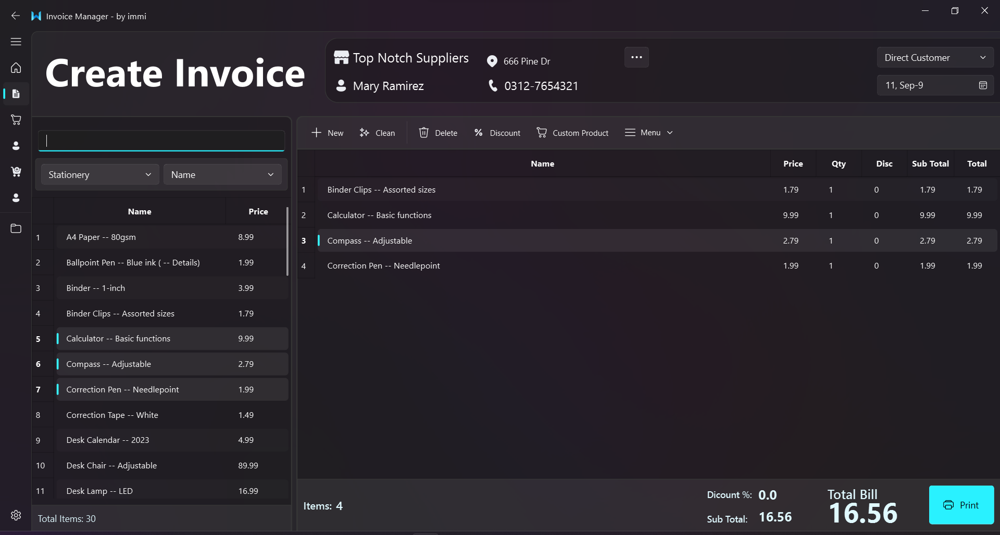
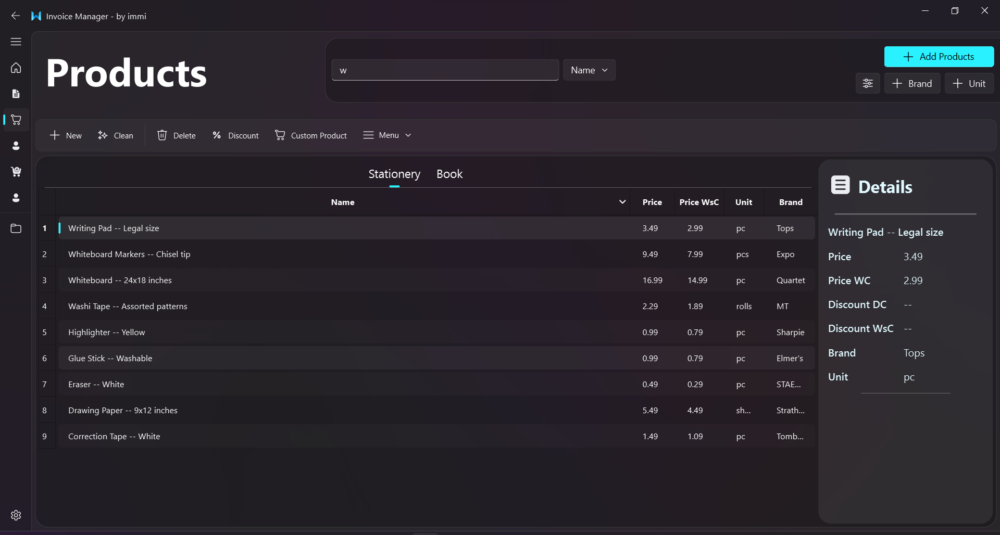
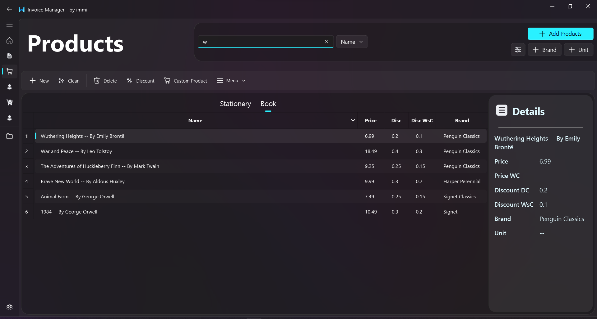
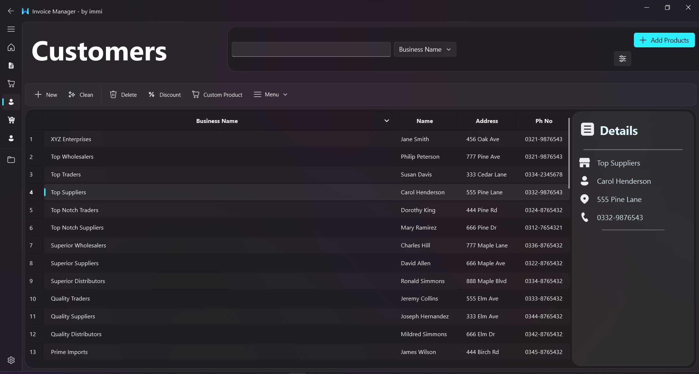
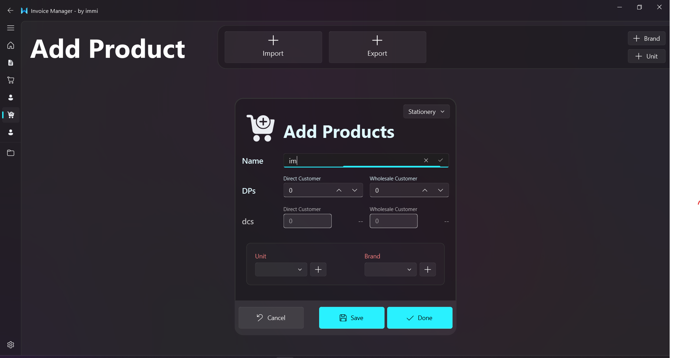
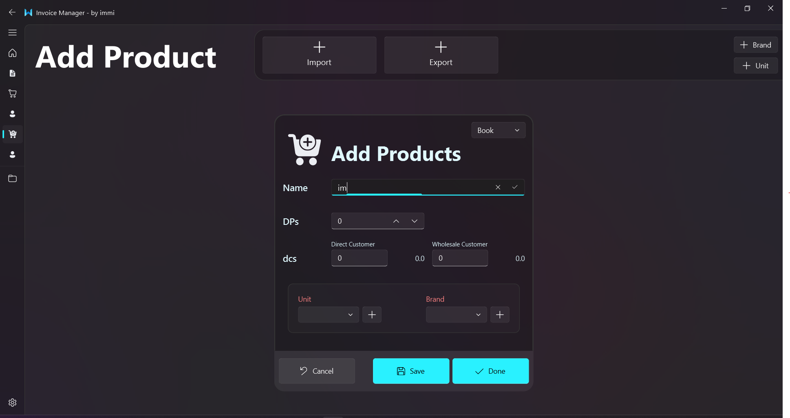
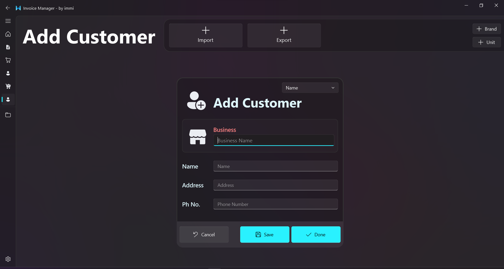

# Invoice Application
### Invoice Manager

## Table of Contents
- [Creating Invoices for Customers (Direct and Wholesale Customers)](#invoiceCreatingLayout)
- [Managing Your Products Data](#ProductViewLayout)
  - [Adding Products to the Database](#AddingProductLayout)
  - [Modifying Products in the Database](#ProductViewLayout)
  - [Deleting Products in the Database](#ProductViewLayout)
- [Managing Your Customers Data](#CustomerViewLayout)
  - [Adding Customers to the Database](#AddingCustomerLayout)
  - [Modifying Customers in the Database](#CustomerViewLayout)
  - [Deleting Customers in the Database](#CustomerViewLayout)
- [Manage History](#project-name)
- [More About](#about)


## ScreenShots
  <a name="invoiceCreatingLayout"></a>
  ### Invoice Creating Layout
  


  <a name="ProductViewLayout"></a>
  ### Products View Layout
  For Stationery
  

  For Books
  

  <a name="CustomerViewLayout"></a>
  ### Customers View Layout
  


  <a name="AddingProductLayout"></a>
  ### Adding Products
  #### Stationery
  
  #### Book
  


  <a name="AddingCustomerLayout"></a>
  ### Adding Customers
  


<a name="about"></a>
## About

Invoice Manager
Creating Invoices with easy and simple steps.

Full Name: **Imran Abid**

Created by: [immi](mailto:mimranabid2@gmail.com)
[Email me](mailto:mimranabid2@gmail.com)

Provide a concise overview of your project. Explain its purpose, what problem it solves, or any goals you have for it. You can also include a badge indicating the project's status, like build passing or version number.

<!-- ## Getting Started

Include information on how to get started with your project. This section should cover prerequisites, installation instructions, and any initial setup required.

### Prerequisites

List any software or tools that users need to have installed before they can use your project.

### Installation

Provide step-by-step instructions on how to install your project. You can use code blocks to show commands:

```bash
$ git clone https://github.com/yourusername/yourproject.git
$ cd yourproject
$ npm install -->
